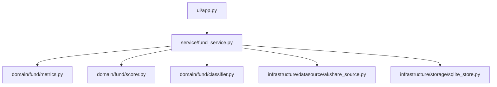

# FundScope 架构说明

## 1. 系统概述

FundScope 采用四层架构，依赖方向严格单向：

```
ui → service → domain → infrastructure
```

### 设计目标

- **数据驱动** - 所有决策基于可量化的指标
- **策略可验证** - 回测框架支持策略验证
- **决策可解释** - 每个信号都有明确的理由

---

## 2. 架构分层

### 2.1 UI 层（ui/）

**职责：** 用户界面交互，Streamlit 页面

**文件：**
- `ui/app.py` - 应用入口
- `ui/pages/1_fund_research.py` - 基金研究页
- `ui/pages/2_portfolio.py` - 持仓诊断页
- `ui/pages/3_strategy_lab.py` - 策略验证中心

**原则：**
- 不包含业务逻辑
- 仅调用 service 层接口
- 状态管理使用 st.session_state

### 2.2 Service 层（service/）

**职责：** 编排业务流程，协调 domain 层和 infrastructure 层

**文件：**
- `service/fund_service.py` - 基金分析编排
- `service/portfolio_service.py` - 持仓分析编排
- `service/simulation_service.py` - 模拟账户编排

**原则：**
- 负责事务管理
- 负责数据持久化
- 不直接处理业务规则

### 2.3 Domain 层（domain/）

**职责：** 纯业务逻辑，零 IO

**子域：**
- `domain/fund/` - 基金子域（指标、评分、分类）
- `domain/portfolio/` - 组合子域（持仓、诊断）
- `domain/simulation/` - 模拟子域（账户、交易）

**原则：**
- 不调用外部 API
- 不读写文件/数据库
- 仅使用 dataclass 和 DataFrame

### 2.4 Infrastructure 层（infrastructure/）

**职责：** 数据源和存储实现

**模块：**
- `infrastructure/datasource/` - 数据源接口和实现
- `infrastructure/storage/` - 存储实现（Parquet、SQLite）

**原则：**
- 实现可插拔数据源
- 封装 IO 操作
- 向上层提供统一接口

---

## 3. 核心数据模型

### 3.1 基金层

```python
@dataclass
class FundInfo:
    """基金基本信息"""
    fund_code: str
    fund_name: str
    fund_type: str
    primary_sector: str
    sectors: list[str]
    sector_source: str  # 'auto' | 'auto_ambiguous' | 'auto_unknown' | 'manual'
    manager_name: str
    manager_tenure: float
    fund_size: float
    management_fee: float
    custodian_fee: float
    subscription_fee: float
    data_version: str

@dataclass
class FundMetrics:
    """基金绩效指标"""
    fund_code: str
    return_1y: float | None
    return_3y: float | None
    return_5y: float | None
    annualized_return: float | None
    max_drawdown: float | None
    volatility: float | None
    sharpe_ratio: float | None
    win_rate: float | None
    recovery_factor: float | None
    data_completeness: float  # 可算指标数 / 总指标数

@dataclass
class FundScore:
    """基金综合评分"""
    fund_code: str
    total_score: float
    return_score: float | None
    risk_score: float | None
    stability_score: float | None
    cost_score: float | None
    size_score: float | None
    manager_score: float | None
    data_completeness: float
    missing_dimensions: list[str]
```

### 3.2 组合层

```python
@dataclass
class Position:
    """持仓"""
    fund_code: str
    fund_name: str
    amount: float  # 事实字段
    weight: float  # 派生字段
    shares: float | None
    cost_nav: float | None

@dataclass
class Portfolio:
    """投资组合"""
    portfolio_id: str
    positions: list[Position]
    total_amount: float
    effective_n: float  # 1 / sum(weight²)
    created_at: datetime
    updated_at: datetime

@dataclass
class PortfolioDiagnosis:
    """组合诊断结果"""
    concentration_risk: float  # HHI 指数
    effective_n: float
    sector_overlap: list[str]
    missing_defense: bool
    style_balance: dict[str, float]
    suggestions: list[str]
```

### 3.3 模拟层

```python
@dataclass
class Trade:
    """交易记录"""
    trade_id: str
    account_id: str  # 必填
    fund_code: str
    action: Literal["BUY", "SELL"]
    amount: float
    nav: float
    shares: float
    trade_date: date
    reason: str

@dataclass
class VirtualAccount:
    """虚拟账户"""
    account_id: str
    initial_cash: float
    cash: float
    positions: list[Position]
    trades: list[Trade]
    equity_curve: list[tuple[date, float]]
    created_at: datetime
```

---

## 4. 评分体系

### 4.1 动态权重

不同基金类型使用不同权重：

```python
SCORE_WEIGHTS_BY_TYPE = {
    "equity": {"return": 0.35, "risk": 0.25, "stability": 0.20, "cost": 0.10, "size": 0.05, "manager": 0.05},
    "bond": {"return": 0.20, "risk": 0.35, "stability": 0.25, "cost": 0.10, "size": 0.05, "manager": 0.05},
    "index": {"return": 0.35, "risk": 0.25, "stability": 0.15, "cost": 0.15, "size": 0.05, "manager": 0.05},
    "mixed": {"return": 0.30, "risk": 0.25, "stability": 0.20, "cost": 0.10, "size": 0.08, "manager": 0.07},
}
```

### 4.2 缺失处理

- 某维度数据缺失时，该维度权重重新分配
- `data_completeness` 记录参与评分的维度比例
- `missing_dimensions` 列出缺失维度

---

## 5. 赛道分类

### 5.1 关键词匹配

```python
SECTOR_KEYWORDS = {
    "红利低波": ["红利", "低波", "高股息", "dividend"],
    "半导体": ["半导体", "芯片", "集成电路", "科创芯片"],
    "医疗": ["医疗", "医药", "生物", "健康", "医健"],
    "AI": ["人工智能", "AI", "数字经济", "科技创新"],
    "消费": ["消费", "白酒", "食品", "零售"],
    "新能源": ["新能源", "光伏", "储能", "电池", "碳中和"],
    "债券": ["债券", "纯债", "信用债", "利率债"],
    "宽基指数": ["沪深 300", "中证 500", "中证 1000", "全 A"],
}
```

### 5.2 分类规则

- 按字典顺序取第一个命中的赛道作为 `primary_sector`
- 所有命中的赛道加入 `sectors` 列表（多标签）
- 多命中时 `sector_source = "auto_ambiguous"`
- 无命中时 `primary_sector = "未分类"`

---

## 6. 缓存策略

### 6.1 三层存储

```
L1: 内存缓存（TTL 30 分钟）
    ↓
L2a: 原始响应缓存（data/cache/，TTL 7 天）
    ↓
L2b: 处理后持久化（Parquet + SQLite，长期）
```

### 6.2 读取路径

1. L1 命中 → 返回
2. L2a 命中且未过期 → 解析后返回并写 L1
3. L2b 命中 → 返回并写 L1
4. 全部未命中 → 请求数据源 → 写 L2a → 解析 → 写 L2b → 写 L1

---

## 7. 数据库设计

### 7.1 SQLite 表结构

```sql
-- 基金信息
CREATE TABLE fund_info (
    fund_code TEXT PRIMARY KEY,
    fund_name TEXT NOT NULL,
    fund_type TEXT,
    primary_sector TEXT,
    sectors TEXT,  -- JSON
    sector_source TEXT,
    ...
);

-- 评分结果
CREATE TABLE fund_score (
    fund_code TEXT PRIMARY KEY,
    total_score REAL,
    return_score REAL,
    risk_score REAL,
    ...
    missing_dimensions TEXT,  -- JSON
    scored_at DATETIME NOT NULL
);

-- 持仓组合
CREATE TABLE portfolio (
    portfolio_id TEXT PRIMARY KEY,
    total_amount REAL,
    effective_n REAL,
    created_at DATETIME NOT NULL,
    updated_at DATETIME NOT NULL
);

CREATE TABLE portfolio_position (
    id INTEGER PRIMARY KEY AUTOINCREMENT,
    portfolio_id TEXT NOT NULL,
    fund_code TEXT NOT NULL,
    fund_name TEXT,
    amount REAL NOT NULL,
    weight REAL NOT NULL,
    ...
);

-- 虚拟账户
CREATE TABLE virtual_account (
    account_id TEXT PRIMARY KEY,
    initial_cash REAL NOT NULL,
    cash REAL NOT NULL,
    created_at DATETIME NOT NULL
);

CREATE TABLE trade_record (
    trade_id TEXT PRIMARY KEY,
    account_id TEXT NOT NULL,
    fund_code TEXT NOT NULL,
    action TEXT NOT NULL,
    amount REAL NOT NULL,
    nav REAL NOT NULL,
    shares REAL NOT NULL,
    trade_date DATE NOT NULL,
    reason TEXT,
    ...
);
```

---

## 8. 依赖关系



### 禁止的依赖

- ❌ ui → domain（必须通过 service）
- ❌ ui → infrastructure（必须通过 service）
- ❌ domain → infrastructure（零 IO）
- ❌ infrastructure → domain/service（单向依赖）

---

## 9. 扩展指南

### 9.1 添加新数据源

```python
from infrastructure.datasource.abstract import AbstractDataSource

class CustomDataSource(AbstractDataSource):
    def get_fund_basic_info(self, fund_code: str) -> dict:
        # 自定义实现
        pass

    def get_fund_nav_history(self, fund_code: str) -> list[dict]:
        # 自定义实现
        pass
```

### 9.2 添加新指标

1. 在 `FundMetrics` 添加字段
2. 在 `metrics.py` 实现计算函数
3. 在 `scorer.py` 集成到评分

### 9.3 添加新页面

在 `ui/pages/` 创建 `<N>_<name>.py`，Streamlit 自动识别。

---

## 10. 参考文档

- [快速开始](quickstart.md)
- [开发指南](development.md)
- [设计文档](../superpowers/specs/2026-03-21-fundscope-design.md)
